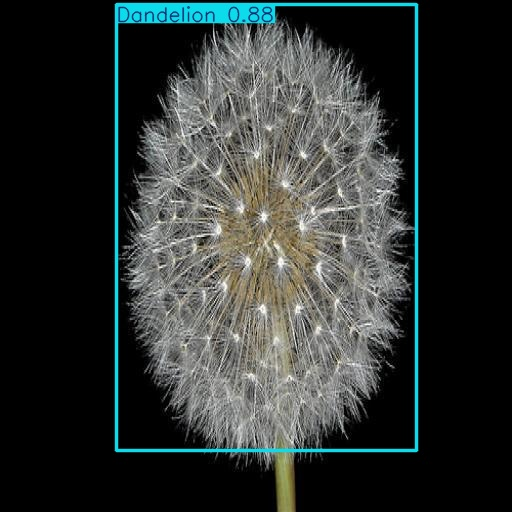

# Flower-Recognition-and-Detection-with-PyTorch

## Table of Contents

- [Project Overview](#project-overview)
- [Dataset](#dataset)
- [Methods with PyTorch](#methods-with-pytorch)
- [Visualization and Preprocessing](#visualization-and-preprocessing)
- [Transfer Learning with timm](#transfer-learning-with-timm)
  - [Model Architecture](#transfer-learning-model-architecture)
  - [Results of Transfer Learning](#results-of-transfer-learning)
- [Object Detection with YOLO](#object-detection-with-yolo)
  - [Implementation](#implementation)
  - [Results of Object Detection](#results-of-object-detection)
- [Key Insights](#key-insights)
- [How to Run](#how-to-run)
- [Interactive Results Visualization](#interactive-results-visualization)


## 🌟 Project Overview

This repository is the seventh project of the master's degree in AI Engineering with [Profession AI](https://profession.ai), all the credits for the requests and idea go to this team. 

GreenTech Solutions Ltd., a pioneer in the agritech industry, is faced with the critical need to implement an advanced automatic flower recognition system within its daily operations. GreenTech Solutions Ltd. has started a strategic initiative to develop a prototype AI-based Computer Vision model for automatic flower recognition.

Project Benefits:
- Increased Productivity
- Improved Quality
- Technological Innovation

The main goal is to develop a highly robust model, capable of automatically classifying flowers with the best possible F1-score (macro) on the test dataset. I need to use techniques such as:
- Augmentation Strategies: implement different augmentation techniques to enrich the dataset, improving data variability and quality.
- Network Architectures and Transfer Learning: select and implement one or more neural network architectures wiht PyTorch's timm library, using transfer learning to exploit pre-trained models.
- Validation and Regularization: retraining with validation and regularization techniques to improve the model performance.
- Object detection: this part has to be done using YOLO models and supervsion library from Roboflow.

## 🍽️ Dataset

The dataset provided by ProfessionAI ([link](https://proai-datasets.s3.eu-west-3.amazonaws.com/progetto-finale-flowes.tar.gz) to download this dataset) includes two main categories of flowers:

- Daisy: 529 training images, 163 validation, 77 test.
- Dandelion: 746 training images, 201 validation, 105 test.

## 🛠️ Methods with PyTorch

This project leverages PyTorch to implement a robust and flexible system for training and evaluating CNN models. I've designed several custom classes to streamline the experimental process, you can find them [here](src/models.py)

### Experiment Class

The `Experiment` class serves as the backbone of the training pipeline. It manages:

- Logging of training progress
- Saving and loading of model weights
- Visualization of training history
- Exporting of results

Key features:
- Automatic creation of directory structure for each experiment
- CSV logging of training and validation metrics
- Plotting of training history
- JSON export of final results

### Callback System

I've implemented a callback system inspired by Keras, allowing for flexible control of the training process:

1. **EarlyStopping**: Prevents overfitting by stopping training when a monitored metric has stopped improving.
2. **ModelCheckpoint**: Saves the best model based on a specified metric.
3. **ReduceLROnPlateau**: Reduces learning rate when a metric has stopped improving.

### Model Architecture

This project leverages PyTorch along with the `timm` (PyTorch Image Models) library as the primary framework for model implementation. The choice of `timm` over traditional `torchvision` models was driven by several key advantages:

- Access to a wider range of state-of-the-art models
- Better documentation and community support
- Consistent API across different model architectures
- Regular updates with the latest architectures
- Pre-trained weights availability

For the classification task, I experimented with three carefully selected models:
1. `efficientnet_b5.sw_in12k_ft_in1k`: A top-performing model known for its efficiency-accuracy trade-off
2. `convnext_base`: A more recent architecture that shows strong performance
3. `resnet50`: A classic architecture serving as a reliable baseline

Each model was tested in two configurations:
- Direct fine-tuning with modified classification head
- Custom classifier addition with trainable layers

### Training and Evaluation Functions

The `train_model` function encapsulates the entire training loop, including:

- Epoch-wise training and validation
- Logging of metrics
- Execution of callbacks
- Resuming training from checkpoints

The `validate` and `get_predictions` functions provide easy-to-use interfaces for model evaluation and inference.


## 🖼️ Visualization and Preprocessing

I conducted a comprehensive Exploratory Data Analysis to understand this dataset better. The full EDA can be found in the [project notebook](project_notebook.ipynb), but here are some key insights:

- Class Distribution: The dataset shows a slight imbalance between classes:
  - Daisy: 529 training images (41.5%), 163 validation images (44.8%), 77 test images (42.3%)
  - Dandelion: 746 training images (58.5%), 201 validation images (55.2%), 105 test images (57.7%)
  While there is an imbalance, the ratio remains consistent across splits and is not severe enough to significantly impact binary classification.

- Image Dimensions: All images are consistently sized at 512x512 pixels.

- Color Distribution: Analysis of a sample of images revealed a tendency towards green tones, with less representation in the blue spectrum, as expected in a flowers dataset.

For a more detailed visual exploration of the dataset, including class distribution plots, image dimension analysis, and color histograms, please refer to the EDA section in the project notebook. Functions code is [here](src/visualization.py)

### Preprocessing and Data Augmentation

Preprocessing pipeline was implemented using the `Albumentations` library, chosen for its efficiency and wide range of image augmentation techniques. The pipeline includes:

1. Resizing: All images are resized to 224x224 pixels to standardize input for these models.
2. Normalization: Images are normalized using mean and standard deviation values of (0.5, 0.5, 0.5) for each channel.

For data augmentation, I implemented a comprehensive approach that includes:

1. Basic geometric transformations:
   - `A.RandomRotate90()`
   - `A.Flip()`
   - `A.Transpose()`

2. Image enhancement transformations (with 0.2 probability):
   - `A.Sharpen(alpha=(0.2, 0.3), lightness=(0.5, 0.7))`
   - `A.RandomBrightnessContrast(brightness_limit=0.1, contrast_limit=0.1)`

These augmentation techniques were carefully selected to preserve the natural appearance of flowers while increasing dataset variability.

You can find [here](src/preprocessing.py) the class Transforms and methods I've used for this project step.


## 🚀 Transfer Learning with timm

### Model Architecture

The project implements a sophisticated transfer learning architecture through a custom `TransferLearningModel` class. This class provides:

- Flexible Model Integration
- Dual Classifier Options:
  - Original classifier with modified output layer
  - Custom classifier with configurable dense layers and dropout
- Layer Freezing Control:
  - Selective layer freezing for fine-tuning optimization
  - Option to freeze all layers except the classifier

This architecture allows for both automated and manual fine-tuning approaches, making it easy to experiment with different transfer learning strategies while maintaining code consistency.

### Results of Transfer Learning

| Model | Config | Train Loss | Val Loss | Train Acc | Val Acc | Train Prec | Val Prec | Train Recall | Val Recall | Train F1 | Val F1 |
|-------|---------|------------|-----------|------------|----------|-------------|-----------|--------------|------------|-----------|---------|
| EfficientNet B5 | Original | 0.96 ± 0.81 | 1.06 ± 0.56 | 0.87 ± 0.08 | 0.87 ± 0.06 | 0.89 ± 0.07 | 0.89 ± 0.06 | 0.89 ± 0.07 | 0.88 ± 0.05 | 0.89 ± 0.07 | 0.88 ± 0.05 |
| EfficientNet B5 | Custom | 0.08 ± 0.10 | 0.16 ± 0.02 | 0.97 ± 0.03 | 0.94 ± 0.01 | 0.97 ± 0.03 | 0.95 ± 0.01 | 0.98 ± 0.02 | 0.94 ± 0.02 | 0.98 ± 0.02 | 0.94 ± 0.01 |
| ConvNext Base | Original | 0.17 ± 0.19 | 0.20 ± 0.14 | 0.93 ± 0.10 | 0.93 ± 0.06 | 0.93 ± 0.09 | 0.94 ± 0.05 | 0.95 ± 0.06 | 0.93 ± 0.11 | 0.94 ± 0.08 | 0.93 ± 0.08 |
| ConvNext Base | Custom | 0.41 ± 1.37 | 0.22 ± 0.20 | 0.92 ± 0.15 | 0.90 ± 0.13 | 0.92 ± 0.13 | 0.92 ± 0.13 | 0.95 ± 0.10 | 0.95 ± 0.07 | 0.93 ± 0.12 | 0.92 ± 0.08 |
| ResNet50 | Original | 0.16 ± 0.08 | 0.15 ± 0.06 | 0.95 ± 0.03 | 0.94 ± 0.01 | 0.94 ± 0.04 | 0.95 ± 0.01 | 0.97 ± 0.01 | 0.94 ± 0.01 | 0.96 ± 0.02 | 0.94 ± 0.01 |
| ResNet50 | Custom | 0.13 ± 0.11 | 0.18 ± 0.03 | 0.95 ± 0.05 | 0.93 ± 0.01 | 0.95 ± 0.05 | 0.94 ± 0.02 | 0.96 ± 0.04 | 0.93 ± 0.04 | 0.96 ± 0.04 | 0.93 ± 0.01 |

Test set results:

| Model | Configuration | Loss | Accuracy | Precision | Recall | F1 Score |
|-------|--------------|------|-----------|------------|---------|-----------|
| EfficientNet B5 | Original | 0.62 | 0.90 | 0.91 | 0.91 | 0.91 |
| EfficientNet B5 | Custom | 0.13 | 0.95 | 0.94 | 0.97 | 0.96 |
| ConvNext Base | Original | 0.12 | 0.97 | 0.98 | 0.97 | 0.98 |
| ConvNext Base | Custom | 0.15 | 0.96 | 0.95 | 0.98 | 0.97 |
| ResNet50 | Original | 0.13 | 0.95 | 0.94 | 0.97 | 0.95 |
| ResNet50 | Custom | 0.15 | 0.93 | 0.95 | 0.93 | 0.94 |

Key observations:
- All models achieved impressive performance with F1 scores consistently above 90%
- Some configurations (particularly EfficientNet B5) showed signs of overfitting, suggesting potential benefits from increased dropout or L2 regularization
- While ConvNext Base achieved the highest test F1 score (0.98), the discrepancy between training/validation and test performance raises concerns about stability
- ResNet50 emerged as the most reliable choice, maintaining consistent performance (~0.95 F1 score) across all splits with minimal variance
- Misclassified images are few, but when you view them with the ground truth you can understand that the models mistake images of flowers taken from below, very small flowers with a lot of background and confuse completely yellow Dandelion with Daisy.


## 📦 Object Detection with YOLO

### Implementation

The object detection implementation heavily leveraged [Roboflow](https://roboflow.com/), an incredible platform that has revolutionized computer vision workflows. Roboflow deserves a special mention for their contributions to the computer vision community:

- Comprehensive tools for dataset preparation and annotation
- Excellent documentation and educational resources
- Popular `supervision` package for computer vision tasks
- High-quality YouTube tutorials and live sessions
- Active community support

The implementation process followed these steps:

1. Dataset Creation with Roboflow:
   - Selected 160 images from the classification dataset (80 per class)
   - Manual annotation using Roboflow's intuitive interface
   - Automatic dataset splitting into train/val/test sets
   - Export in YOLOv11-ready format

2. Model Training:
   - Project ID: flowers-object-detection-zscwu
   - Dataset accessible at: [Flowers Object Detection Dataset](https://universe.roboflow.com/silvano-9j4jy/flowers-object-detection-zscwu/dataset/1)
   - Following Profession AI's guidance for YOLOv11 implementation

### Results of Object Detection

While the object detection component was primarily a proof-of-concept using a small dataset, the results were remarkably good. This demonstrates how modern tools like Roboflow and YOLO can achieve impressive results even with limited data.


*Example of model inference showing bounding box and classification*

The confusion matrix (available in the [`train3`](results_from_detection/train3/confusion_matrix_normalized.png) folder) shows near-perfect detection and classification performance. However, it's important to note that this high performance is partly due to the small, carefully curated dataset and controlled conditions. The main value of this implementation lies in demonstrating the complete workflow:

1. Transitioning from a classification dataset to object detection
2. Utilizing modern tools for dataset preparation
3. Implementing state-of-the-art models
4. Achieving production-ready results efficiently

This proof-of-concept successfully shows how to extend a classification project to include object detection capabilities, providing a template for larger-scale implementations.

## 🎯 Key Insights

1. **Transfer Learning Performance**
  - ResNet50 emerged as the most reliable model with consistent F1 scores ~0.95
  - Custom classifiers improved performance but required careful tuning
  - `timm` library enabled efficient model experimentation

2. **Dataset Handling**
  - Models performed well despite slight class imbalance
  - Data augmentation proved effective for generalization

3. **Object Detection Integration**
  - Roboflow streamlined annotation and dataset preparation
  - YOLOv11n showed excellent performance as proof-of-concept
  - Successful transition from classification to detection task

4. **Robust Code Structure**
  - Modular architecture facilitated model experimentation
  - Comprehensive logging enabled effective performance tracking
  - Flexible design allows easy integration of new models

5. **Future Scalability**
  - Architecture ready for additional models and larger datasets
  - Workflow provides template for production implementations

## 🚀 How to Run

This project can be easily run using Google Colab. Here's how:

1. Open the project notebook in Google Colab.
2. The notebook contains all necessary steps, including cloning the repository and loading the data.
3. Run the cells in order to reproduce the analysis and results.

If you prefer to run the project locally:

1. Clone the repository:

````
git clone https://github.com/Silvano315/Flower-Recognition-and-Detection-with-PyTorch.gits
````

2. Install the required dependencies:

````
pip install -r requirements.txt
````

3. Open and run the Jupyter notebooks in your local environment.

The notebook includes a cell for dataset download and extraction using the `extract_dataset` function from [`utils.py`](src/utils.py). This will automatically handle the dataset setup for you.


## 📊 Interactive Results Visualization

This project includes comprehensive interactive HTML reports generated using DataPane for enhanced visualization and analysis of model performance. The reports provide:

- **Model Performance Metrics**
  - Interactive training and validation curves
  - Real-time metric exploration
  - Learning rate evolution visualization

- **Confusion Matrix Analysis**
  - Interactive confusion matrix
  - Class-wise prediction distribution
  - Hover capabilities for detailed information

- **Performance Summary**
  - Best validation accuracy
  - Best F1 score
  - Final model metrics
  - Training progress visualization

- **Dataset Insights**
  - Number of classes
  - Class distribution
  - Total predictions analysis

